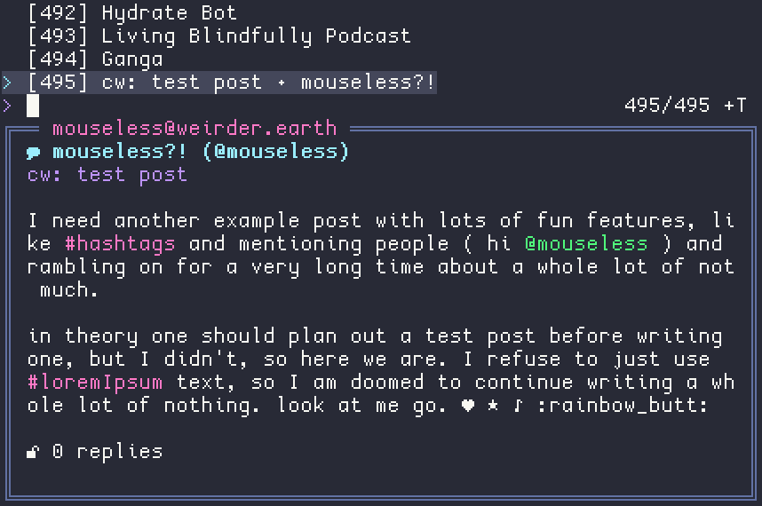
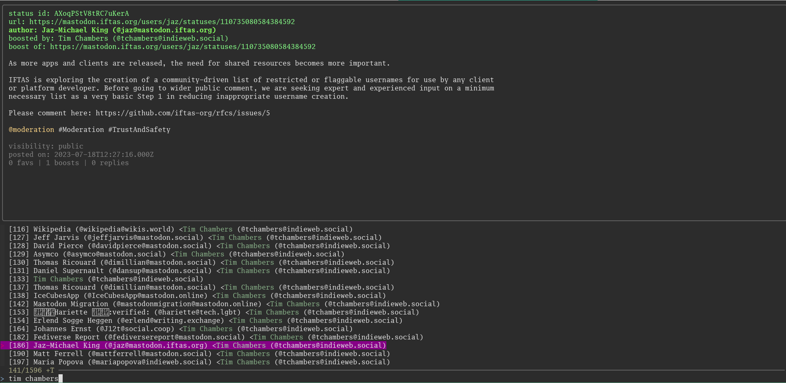

# msync_fzf

A fzf-based fedi timeline browser, for Mastodon and anything that supports the Mastodon API. Uses msync at <https://github.com/Kansattica/msync> for actual interaction, and fzf at <https://github.com/junegunn/fzf> for presentation: this repo is just a bunch of scripts to glue it all.

Hacked extensively to do strange things- features are duct taped on, and will break if you look at them funny. The original is <https://git.sr.ht/~rakoo/msync_fzf>, if you want that.

The icons assume you're using <https://github.com/slavfox/Cozette>, and a few icons are PUA characters. My bad.
## Screenshots





## Usage

```sh
> ./msync_fzf yourUsername@example.com
```

When a line is highlighted with fzf, the post is displayed in the preview window below (preview window togglable with ctrl+space)

To see posts and interact with them, you need to install & configure msync. To synchronize, run `msync sync`

## Bonus Features

Multi account support- you can browse the timeline of, boost, favourite, and sync a specific account, instead of every account you have set up with msync.

Notification browser- press ctrl-n to browse notifications (you can interact with them jut like your home feed, too!)

Boosted posts get filtered out, since they only show a link to the original post anyway.

Content warnings that hide the post by default! To see the post, wait 5 seconds and it'll display the contents.

Write posts & replies!

Various other little tweaks per my personal preference

### Shortcuts

- F5 refreshes the list
- ctrl-n to view notifications (you can exclude boosts/favs/polls in msync's settings)
- ctrl-p to write and queue a post
- ctrl-r to write and queue a reply to the selected post
- ctrl-b (changed from ctrl-u) to queue boosting a post
- ctrl-f (changed from ctrl-s) to queue favouriting a post
- ctrl-space to toggle the post preview (useful if the next post has a CW you don't want to open)
- ctrl-e to jump to oldest post
- ctrl-i to jump to newest
- shift-e to scroll preview down
- shift-i to scroll preview up

### Hack / To Be Hacked

The goal here is to use msync and fzf as workhorses, and glue them to fit my needs. Feel free to change it on your side and make it *yours*

Things that are interesting to dig:

- Add your own shortcuts, or change them by editing the source code directly

- Check out `preview.rc` to tweak what the preview window shows (enable favourites, change colours, that sort of thing)

- I added multi account support, but why not default to the old behaviour if no account is given?

- there are ways to automatically download attached images, maybe do that and display them in a good way?

- there's a way with msync to request the context for a post, fetching the earlier posts in the thread when you sync next... that would be cool

- being able to reply is nice, but automatically setting the post privacy based on the original post would be nice

- browsing your queued posts, and being able to easily reply/edit/delete them?

- Some way of "remembering" your last viewed post, or jumping to the start of the last sync on launch?

## License

Parity Public License 7.0.0

See [LICENSE](./LICENSE) for the full text, or <https://paritylicense.com/versions/7.0.0.html> for more details
