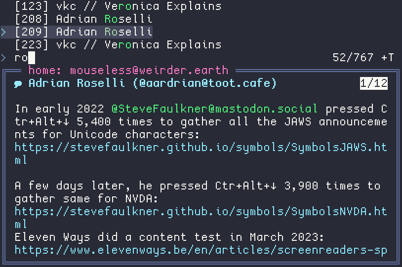

# Halley

A fediverse timeline browser, for Mastodon and anything that supports the Mastodon API. Uses msync at <https://github.com/Kansattica/msync> for actual interaction, and fzf at <https://github.com/junegunn/fzf> for presentation: this repo is just a bunch of scripts to glue it all. Originally forked from <https://git.sr.ht/~rakoo/msync_fzf>.

## Screenshots




## Usage

This tool relies on msync, which you need to install & configure first. You'll also need to install fzf.

Download this repository however you prefer to do that (click the green Code button if you're unsure how), unzip that file if needed, and with a terminal open in the same directory as the files, run:

```sh
./halley.rc yourUsername@example.com
```

When a line is highlighted, the post is displayed in the preview window below (preview window togglable with ctrl+space)


To add tab autocompletion, run `touch yourUsername@example.com`. It's not a smart way of doing it, but I am not a smart programmer, and it does technically work. 

## Features

Multiple account support- you can browse the timeline of, boost, favourite, and sync a specific account, instead of every account you have set up with msync.

Notification browser- press ctrl-n to browse notifications (you can interact with them jut like your home feed, too!)

Queue browser- press ctrl-q to browse posts you've written but haven't been posted yet. 

Boosted posts get filtered out, since they only show a link to the original post anyway.

Content warnings that hide the post by default! To see the post, wait 5 seconds and it'll display the contents. 

Write posts & replies!

## Shortcuts

- Start typing to search usernames and content warnings. Case insensitive, use a ! to exclude your search (e.g. !cw for showing all posts that don't have a CW)
- F5 syncs the current account
- ctrl-n to view notifications (you can exclude boosts/favs/polls in msync's settings, or filter by searching `!*` (no favs), `@` (only mentions), and so on)
- ctrl-q to view queued posts (then ctrl-v to edit a post) 
- ctrl-p to write and queue a post
- ctrl-r to write and queue a reply to the selected post
- ctrl-b to queue boosting a post
- ctrl-f to queue favouriting a post
- ctrl-space to toggle the post preview
- ctrl-e to jump to oldest post
- ctrl-i to jump to newest
- shift-e to scroll preview down
- shift-i to scroll preview up

## License

Parity Public License 7.0.0

See [LICENSE](./LICENSE) for the full text, or <https://paritylicense.com/versions/7.0.0.html> for more details
